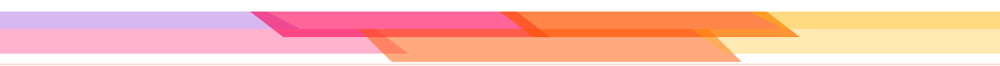

  <!-- ==================== HEADER ==================== -->
  

  <!-- ==================== TYPING SUBTITLE ==================== -->
  

    

  <!-- ==================== HERO ANIMATION (FULL WIDTH) ==================== -->
  

 

### Hey there, I'm Ayush 👋

I like building full-stack web applications, automation pipelines, and exploring cybersecurity. Most of my time is spent crafting with TypeScript, Python, React, and NestJS, optimizing real-time data flows, and turning ideas into clean, functional tools.

- 💻 Writing mostly **TypeScript** & **Python**
- 🛡️ Passionate about **Cybersecurity**, web defense, and content moderation
- 📈 Building [**StockScout**](https://github.com/ayushagnihotrii/StockScout) for automated stock monitoring and real-time alerts
- 🛡️ Architecting [**orbit / SafeSpace**](https://github.com/ayushagnihotrii/orbit) with NestJS, FastAPI, and Next.js
- 🛒 Developing [**Swap-Society**](https://github.com/ayushagnihotrii/Swap-Society) student marketplace & [**kaizen**](https://github.com/ayushagnihotrii/kaizen) habit tracker
- 📚 Always curious and happy to learn something new

 

---

### 🛠️ Tools & Technologies

  

 

---

### 📦 Things I've Built

| Project | Description | Stack |
| :--- | :--- | :--- |
| 📈 [**StockScout**](https://github.com/ayushagnihotrii/StockScout) | Automated stock monitoring system with real-time Telegram alerts and price tracking. | `Python` `Automation` `Finance` |
| 🛡️ [**orbit / SafeSpace**](https://github.com/ayushagnihotrii/orbit) | Modern community safety platform with automated content moderation and threat detection. | `NestJS` `Next.js` `FastAPI` |
| 🛒 [**Swap-Society**](https://github.com/ayushagnihotrii/Swap-Society) | Campus-focused peer-to-peer student marketplace for verified item exchange. | `TypeScript` `React` `Full-Stack` |
| 🎯 [**kaizen**](https://github.com/ayushagnihotrii/kaizen) | Minimalist habit tracking and productivity engine with real-time streak synchronization. | `React` `Firebase` `Tailwind` |
| 🎪 [**sponsoria / FestConnect**](https://github.com/ayushagnihotrii/sponsoria) | Event and college fest sponsorship matchmaking platform for student organizers. | `JavaScript` `Web` `Marketplace` |
| 🌸 [**Didital_bouquet**](https://github.com/ayushagnihotrii/Didital_bouquet) | Interactive digital bouquet builder and flower greeting canvas for heartfelt gifting. | `Next.js` `Creative Tech` `React` |

 

---

### 🏙️ 3D Contribution Skyline

  <picture>
    <source media="(prefers-color-scheme: dark)" srcset="https://raw.githubusercontent.com/ayushagnihotrii/ayushagnihotrii/main/profile-3d-contrib/profile-night-view.svg" />
    <source media="(prefers-color-scheme: light)" srcset="https://raw.githubusercontent.com/ayushagnihotrii/ayushagnihotrii/main/profile-3d-contrib/profile-green.svg" />
    
  </picture>

 

---

### 🐍 Contribution Snake

  <picture>
    <source media="(prefers-color-scheme: dark)" srcset="https://raw.githubusercontent.com/ayushagnihotrii/ayushagnihotrii/output/github-snake-dark.svg" />
    <source media="(prefers-color-scheme: light)" srcset="https://raw.githubusercontent.com/ayushagnihotrii/ayushagnihotrii/output/github-snake.svg" />
    
  </picture>

 

---

### 📈 Activity & Stats

  <!-- Activity Trend Graph (Reliable Mirror) -->
  

    

  <!-- GitHub Streak Stats -->
  

    

  <!-- Fast Cached GitHub Stats & Top Languages -->
  
  &nbsp;
  

 

---

### 📬 Say Hello

  
  &nbsp;
  
  &nbsp;
  

    

  <!-- Profile Visitor Counter -->
  

 

<!-- ==================== FOOTER ==================== -->

